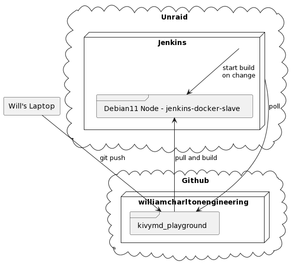

# Buildozer Example Project For Jenkins

This project is a simple copy-paste of the example app from [KivyMD](https://kivymd.readthedocs.io/en/latest/getting-started/) First application.

The purpose of _this_ particular repository is to show a Jenkins-based build with a dedicated Debian11 build node.



# APPENDIX

Setting up the Debian11 Node (`jenkins-docker-slave`).

```console
apt install -y \
    git \
    zip \
    unzip \
    openjdk-17-jdk \
    python3-pip \
    autoconf \
    libtool \
    pkg-config \
    zlib1g-dev \
    libncurses5-dev \
    libncursesw5-dev \
    libtinfo5 \
    cmake \
    libffi-dev \
    libssl-dev
```
